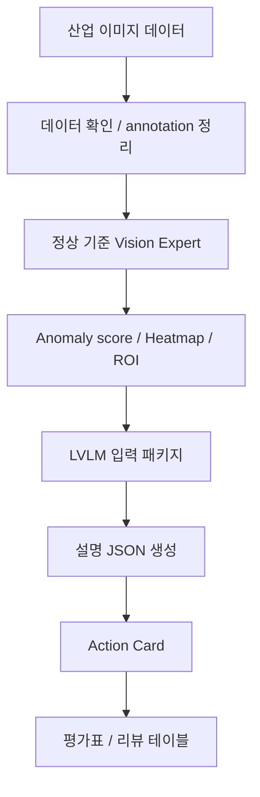

# Explainable Industrial Anomaly Detection

졸업프로젝트 | 2026.03 ~

## 한 줄 요약

산업 검사 이미지를 정리하고, 이상 의심 영역을 찾은 뒤, LVLM 설명과 Action Card까지 연결하는 anomaly detection 파이프라인입니다.

## 왜 만들었나

산업 현장 이미지는 정리된 예시 이미지처럼 깨끗하지 않고, 정상 데이터가 훨씬 많으며, 이상 라벨은 적거나 기준이 흔들릴 수 있습니다. 그래서 모델 하나를 붙이는 것보다 먼저 데이터를 정리하고, 정상 기준으로 이상 위치를 찾고, 그 결과를 사람이 확인 가능한 형태로 바꾸는 흐름이 중요하다고 보았습니다.

현재는 OPGW 데이터를 바로 학습에 쓰기 전 단계라, MVTec AD Cable 데이터를 proxy로 사용해 전체 구조를 검증하고 있습니다. 모델 성능을 크게 주장하기보다는 데이터 정리, 입력 구성, 결과 해석 흐름을 만드는 데 초점을 뒀습니다.

## 구현한 것

- MVTec AD Cable 데이터 기준 annotation CSV 생성과 데이터 구조 점검
- 정상 이미지 기준 baseline Vision Expert와 PatchCore 연결 코드 구성
- anomaly score, heatmap, ROI crop을 생성해 이상 의심 위치 시각화
- 원본 이미지, heatmap, ROI crop, anomaly score, 후보 결함 정보를 LVLM 입력 manifest로 묶는 구조 구현
- mock LVLM과 OpenAI LVLM 호출 코드를 분리해 비용 없이 형식 검증 후 실제 호출 가능하게 구성
- LVLM 설명 JSON을 결함 위치, 시각적 근거, 위험도, 추가 확인 항목이 담긴 Action Card로 변환
- vision metric과 LVLM 결과를 따로 평가할 수 있는 CSV/리뷰 테이블 생성

## 흐름

## 현재 경계와 다음 방향

- 현재는 실제 OPGW 전체 데이터가 준비된 상태가 아니어서 MVTec AD Cable로 workflow를 검증하고 있습니다.
- 실제 현장 데이터가 들어오면 먼저 이미지 품질, 라벨 불균형, 결함 기준, train/test 분리부터 정리해야 합니다.
- 이후 Vision Expert 성능을 비교하고, LVLM이 결함을 과하게 단정하지 않도록 unknown anomaly와 근거 설명 품질을 따로 평가할 계획입니다.
- 최종 목표는 모델 성능 숫자만 보여주는 것이 아니라, 검사자가 어떤 이미지를 다시 봐야 하는지와 왜 봐야 하는지를 정리하는 흐름입니다.

## 기술

Python, PyTorch, anomaly detection, heatmap/ROI visualization, LVLM-based explanation, MVTec AD Cable

## 코드

공개 repository: [explainable-industrial-anomaly-detection](https://github.com/arnold6444/explainable-industrial-anomaly-detection)
