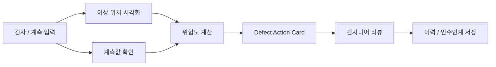

# SemiVision Defect Copilot

개인 프로젝트 | 2026.03 ~

## 한 줄 요약

반도체 검사 이미지와 계측값을 보고, 이상 위치와 확인할 항목을 Action Card로 정리하는 품질 판단 보조 대시보드입니다.

## 왜 만들었나

제조 검사에서는 정상/불량 라벨만으로 부족합니다. 이상이 어디에 있는지, 어느 정도 위험한지, 어떤 항목을 다시 확인해야 하는지, 엔지니어가 어떤 판단을 했는지가 함께 남아야 실제 업무 흐름에 가깝다고 보았습니다.

## 구현한 것

- FastAPI backend와 React dashboard로 검사 실행, 결과 확인, 리뷰, 인수인계 화면 구성
- synthetic wafer image로 9가지 defect 상황을 만들고 wafer map, overlay, ROI crop 표시
- lot, wafer, 장비, 공정 단계, recipe, CD/overlay/thickness 등 계측값 입력 구조 설계
- 이미지 위치와 계측값을 함께 보고 위험도와 검토 필요 여부 계산
- Defect Action Card에 의심 원인, 추가 확인 항목, 다음 조치, human review rule 정리
- SQLite에 검사 이력, 엔지니어 리뷰, handoff 상태 저장

## 흐름

## 기술

Python, FastAPI, React, Vite, SQLite, OpenCV, scikit-learn, Recharts

## 코드

코드는 실행 산출물을 제외한 상태로 비공개 저장소에 정리해 두었고, 필요 시 공유할 수 있습니다.
