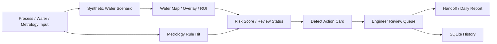

# SemiVision Defect Copilot

개인 프로젝트 | 2026.03 ~

## 프로젝트 목적

제조 검사 workflow에서는 단순히 정상/불량 라벨만 보여주는 것만으로는 부족합니다. 사용자는 이상이 어디에 있는지, 어떤 공정/계측 조건과 함께 봐야 하는지, 추가로 확인할 항목은 무엇인지, 엔지니어 판단 이력이 어떻게 남는지를 함께 봐야 합니다.

SemiVision Defect Copilot은 WaferGuard 프로젝트에서 확장한 반도체 품질 판단 보조 MVP입니다. 공정 이상 상황을 시뮬레이션하고, wafer map/계측값/공정 정보를 바탕으로 품질 리스크와 후속 action을 Defect Action Card, 리뷰 큐, 인수인계 흐름으로 연결하는 데 초점을 두었습니다.

## 구현한 것

FastAPI backend와 React dashboard를 구성해 검사 실행, 엔지니어 리뷰, metrics, automation, handoff, Fab Ops Copilot 화면을 구현했습니다. 입력은 실제 fab 데이터가 아니라 synthetic wafer image와 fixture 기반 시뮬레이션 데이터이며, 실제 데이터처럼 과장하지 않도록 화면과 문서에서 데이터 경계를 분리했습니다.

검사 요청에는 lot/wafer/line/equipment/process step/recipe 정보와 CD, overlay, film thickness, roughness, defect count, yield proxy 같은 계측값을 함께 입력하도록 설계했습니다. 이후 wafer map, Grad-CAM style overlay, ROI crop, metrology rule hit, RAG 유사 사례를 묶어 risk score와 Action Card를 생성합니다.

## Workflow

## 주요 구현 내용

- FastAPI 기반 Agent workflow API와 React 운영 dashboard 구현
- 9개 wafer defect 상황을 synthetic wafer image로 생성하고 wafer map, Grad-CAM style overlay, ROI crop 제공
- 공정 step, 장비, recipe, CD/overlay/thickness/roughness/defect count/yield proxy를 함께 받는 검사 요청 구조 설계
- metrology rule hit와 hotspot ratio를 risk score, review status, Action Card 조치 후보에 반영
- Defect Action Card에 가능 원인, 추가 metrology 확인 항목, process check, next action, human review rule 정리
- SQLite에 검사 이력, 엔지니어 리뷰, handoff 상태를 저장하고 dashboard에서 review queue, defect mix, Daily Report, Fab Ops Copilot 흐름으로 확인 가능하게 구성

## 기술 스택

Python, FastAPI, React, Vite, SQLite, OpenCV, scikit-learn, Recharts

## 공개 상태

민감정보와 실행 산출물을 제거한 private GitHub source snapshot을 준비했습니다.

- 저장소: `arnold6444/semivision-defect-copilot`
- 공개 범위: private
- 포함한 것: FastAPI backend, Action Card logic, synthetic wafer image pipeline, SQLite storage flow, React dashboard source, smoke test
- 제외한 것: `.git`, `.venv`, outputs, node_modules, frontend build output, local execution artifacts

채용 검토 과정에서 코드 확인이 필요하면 접근 권한을 별도로 공유할 수 있습니다.

## 다음 보완

- wafer map, overlay, ROI crop 화면 캡처 추가
- Defect Action Card 화면 캡처 추가
- review queue, handoff, Fab Ops Copilot 흐름 구조도 추가
- 안정적으로 실행되는 dashboard demo 배포 후 링크 연결
