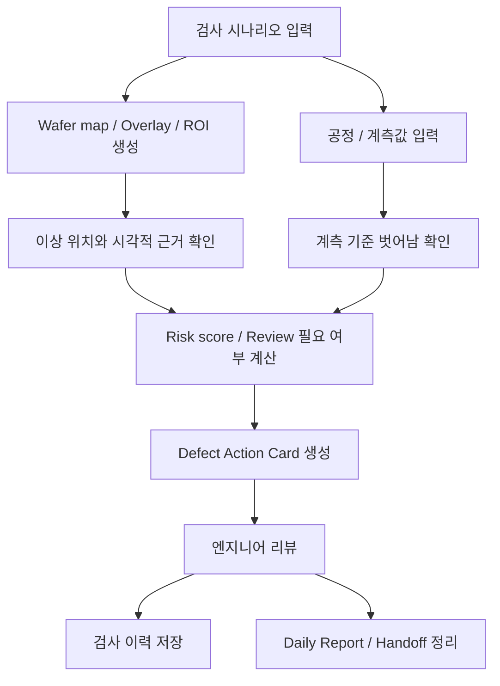

# WaferGuard

개인 프로젝트 | 2026.03 ~

## 한 줄 요약

반도체 웨이퍼 결함 상황을 데모 데이터로 만들어보고, 검사 결과가 리뷰와 인수인계까지 이어지게 만든 로컬 대시보드입니다.

## 왜 만들었나

정확히 어떤 공정 원인인지 제가 단정할 수는 없지만, 검사 결과가 정상/불량이나 점수로만 끝나는 것도 부족하다고 생각했습니다. 사람이 다시 봐야 할 위치, 같이 확인할 계측값, 다음 확인 항목, 리뷰 기록이 한곳에 남아야 실제 운영 흐름에 더 가깝다고 보았습니다.

그래서 모델 정확도 자체보다 `검사 결과 -> 근거 확인 -> 리뷰 필요 여부 -> Action Card -> 인수인계`로 이어지는 흐름을 먼저 만들었습니다. 현재는 실제 fab 데이터를 사용한 시스템이 아니라, synthetic wafer image와 fixture 데이터를 이용해 구조를 검증한 시뮬레이션입니다.

## 구현한 것

- FastAPI backend와 React dashboard로 검사 실행, 결과 확인, 엔지니어 리뷰, 인수인계 화면 구성
- 9가지 wafer defect 상황을 synthetic wafer map, Grad-CAM style overlay, ROI crop으로 시각화
- lot, wafer, line, 장비, 공정 step, recipe, CD/overlay/thickness/defect count 등 입력 구조 설계
- 계측값이 기준을 벗어나는 경우 표시하고 review 필요 여부에 반영
- Defect Action Card에 defect 후보, 시각적 근거, 가능 원인 후보, 추가 확인 항목, 다음 action, human review rule 정리
- 검사 이력, 엔지니어 판단, Daily Report, handoff 상태를 SQLite에 저장
- drift/성능 저하 상황, critical miss, class imbalance 같은 운영 리스크를 demo 평가 화면에서 확인

## 흐름

## 현재 경계와 다음 방향

- 현재 입력은 실제 제조 데이터가 아니라 synthetic wafer image, fixture metric, demo 계측값입니다.
- 실제 제조 데이터가 들어오면 synthetic 검사 엔진을 실제 defect classifier와 heatmap/ROI 생성 흐름으로 교체하는 것이 다음 단계입니다.
- MES/FDC/SPC, metrology 결과, 설비 이력 같은 데이터를 연결하면 Action Card의 확인 항목을 더 현실적으로 정리할 수 있습니다.
- 장기적으로는 데이터가 계속 들어올 때 local model이나 기준값을 상황에 맞게 조정하는 구조를 생각하고 있지만, 현재 구현 범위에는 포함하지 않았습니다.
- 실제 현장 엔지니어에게 어떤 형태가 도움이 되는지는 공정 지식과 현장 피드백을 받아 검증해야 합니다.

## 기술

Python, FastAPI, React, Vite, SQLite, OpenCV, scikit-learn, Recharts

## 코드

코드는 실행 산출물을 제외한 상태로 비공개 저장소에 정리해 두었고, 필요 시 공유할 수 있습니다.
