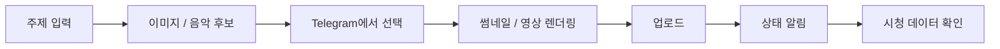

# Youtube Automation System

개인 프로젝트 | 2026.03 ~

## 한 줄 요약

YouTube 플레이리스트 채널 운영에서 반복되는 콘텐츠 제작, 렌더링, 업로드, 상태 확인 과정을 Telegram으로 관리하는 자동화 프로젝트입니다.

## 왜 만들었나

채널을 운영하다 보면 주제 선정, 이미지 후보 확인, 음악 선택, 영상 렌더링, 업로드 확인을 계속 반복해야 합니다. 모든 과정을 완전 자동으로 넘기기보다는, 이미지와 음악은 사람이 고르고 반복 실행과 상태 확인을 자동화하는 구조로 만들었습니다.

## 구현한 것

- Telegram bot에서 콘텐츠 후보 확인, 제작 요청, 렌더링 상태 확인, 업로드 알림을 처리
- 이미지 프롬프트, 음악 후보, 썸네일 후보, 렌더링 결과를 SQLite에 저장
- FFmpeg 기반 영상 렌더링과 YouTube 업로드 흐름 연결
- 긴 작업이 중간에 끊기지 않도록 작업 상태와 로그를 남기는 구조 구성
- YouTube 조회수, 시청 시간, 유입 경로를 확인하는 분석 리포트 기능 확장

## 흐름

## 결과 링크

- YouTube 채널: [saebyeok](https://www.youtube.com/@saebyeok_fi)
- 샘플 영상: [the sky is quiet enough to stay](https://youtu.be/lJHcvyrVvaw)

## 기술

Python, aiogram, SQLite, SQLAlchemy, FFmpeg, Pillow, YouTube Data API/OAuth

## 코드

코드는 운영 토큰과 로컬 산출물을 제외한 상태로 비공개 저장소에 정리해 두었고, 필요 시 공유할 수 있습니다.
