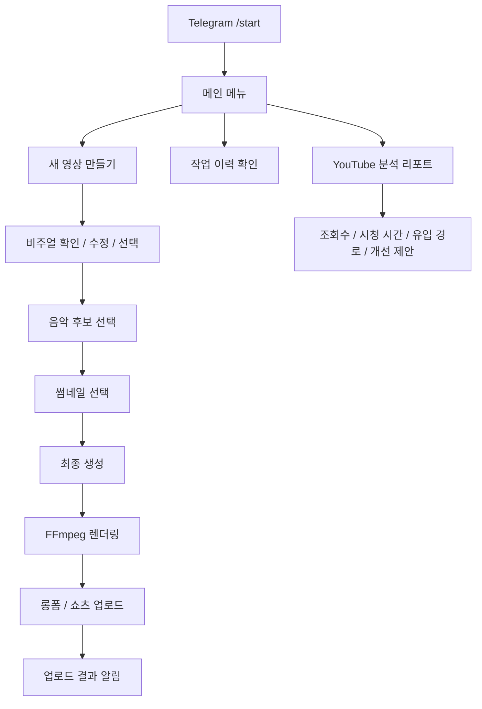

# YouTube Automation System

개인 프로젝트 | 2026.03 ~

## 한 줄 요약

Telegram에서 영상 제작, 렌더링, 업로드, 채널 분석 리포트까지 관리하는 YouTube 플레이리스트 채널 자동화 프로젝트입니다.

## 왜 만들었나

플레이리스트 채널을 운영하다 보면 영상을 만들고, 렌더링이 끝났는지 확인하고, 업로드하고, 조회 데이터를 다시 보는 일이 계속 반복됩니다. 처음부터 전부 자동으로 넘기기보다는 제가 이미지와 음악을 확인하고 선택하면, 그 뒤의 제작 흐름과 상태 알림, 분석 리포트는 봇이 처리하는 구조로 만들었습니다.

## 구현한 것

- Telegram에서 `/start`로 메인 메뉴를 열고 새 영상 만들기, 작업 이력, YouTube 분석, 설정, 서버 종료 기능을 실행
- 새 영상 만들기 흐름에서 비주얼 확인/수정/선택, 음악 후보 선택, 썸네일 선택, 최종 생성 단계 구성
- 선택한 이미지와 음악을 바탕으로 FFmpeg 렌더링을 실행하고, 완료 후 결과 파일과 상태 알림 전송
- YouTube 롱폼/쇼츠 업로드 버튼을 연결해 Telegram 안에서 업로드를 시작하고 결과를 확인
- 작업 상태, 후보 소스, 렌더링 결과, 업로드 이력을 SQLite에 저장
- YouTube Analytics API로 조회수, 시청 시간, 평균 조회율, 인기 영상, 유입 경로, 개선 제안을 리포트 형태로 확인

## 흐름

## 결과 링크

- YouTube 채널: [saebyeok](https://www.youtube.com/@saebyeok_fi)
- 샘플 영상: [YouTube sample](https://youtu.be/O_W28Q6uFfE)

## 다음 방향

- 현재 음악은 외부 소스에서 가져와 후보로 사용하고 있지만, 이후에는 영상 분위기에 맞는 음악을 API로 생성하는 방식으로 바꾸고 싶습니다.
- 현재 영상은 단일 이미지 중심이라, 이후에는 영상 하나에 여러 이미지를 쓰거나 짧은 반복 영상처럼 움직임이 있는 비주얼을 자동으로 붙이는 방향을 생각하고 있습니다.
- 아직 수익화 전이라 로컬 서버에서 운영 검증 중이며, 이후에는 상시 서버 운영과 렌더링/업로드 비용 최적화까지 연결하고 싶습니다.
- 최종 목표는 제작과 업로드가 자동으로 돌아가고, 저는 Telegram으로 결과 리포트만 받아보는 구조입니다.

## 기술

Python, aiogram, SQLite, SQLAlchemy, FFmpeg, Pillow, YouTube Data API/OAuth

## 코드

코드는 운영 토큰과 로컬 산출물을 제외한 상태로 비공개 저장소에 정리해 두었고, 필요 시 공유할 수 있습니다.
